# React application optimization

All meassures were taken for **`CountryList`** component.

## Sorting

Recorded interaction: changing sorting from **default** to sorting **by Name from A to Z**.

| Committed at | Render duration |
| ------------ | --------------- |
| **Before optimization** |      |
| 3.4s         | 27.2ms          |
| 3.5s         | 24.8ms          |
| **After optimization** |       |
| 2s           | 3.4ms           |
| 2.1s         | 2.4ms           |

Before optimization:
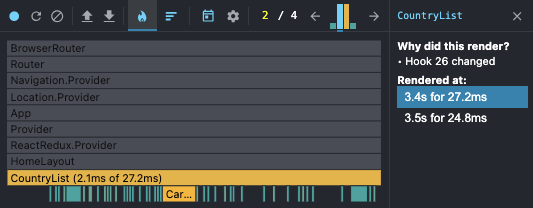
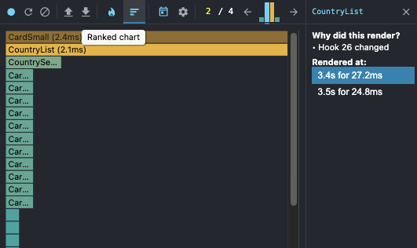

After optimization:
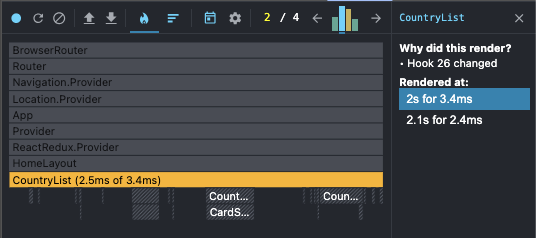
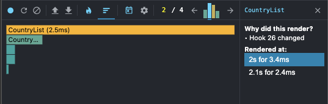

## Filtering

Recorded interaction: changing filtering from **default** to region **Americas**.

| Committed at | Render duration |
| ------------ | --------------- |
| **Before optimization** |      |
| 3.2s         | 26.7ms          |
| 3.3s         | 29.2ms          |
| 3.3s         | 5.8ms           |
| **After optimization** |       |
| 3.4s         | 3.3ms           |
| 3.5s         | 2.8ms           |
| 3.5s         | 0.6ms           |

Before optimization:
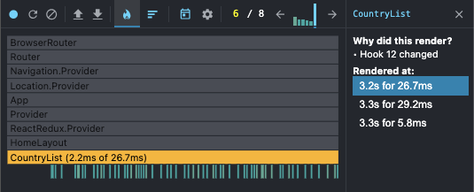
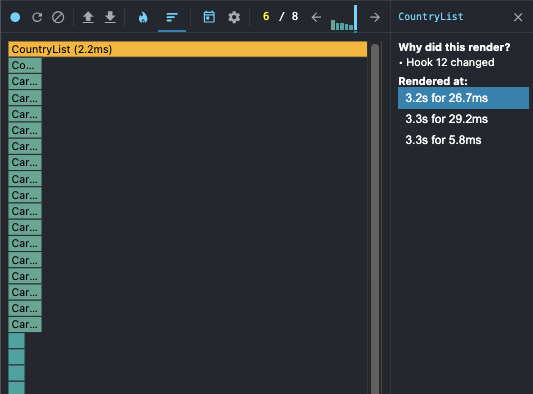

After optimization:
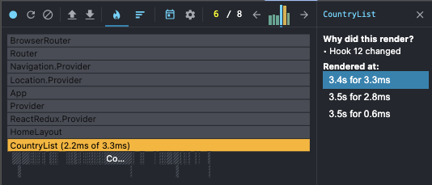
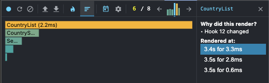

## Like/dislike

Recorded interaction: changing liked state for one country **from dislike to like** and **back to dislike**.

| Committed at | Render duration |
| ------------ | --------------- |
| **Before optimization** |      |
| 1s           | 28.5ms          |
| 1.9s         | 25.5ms          |
| **After optimization** |       |
| 1s           | 3.3ms           |
| 1.8s         | 2.8ms           |

Before optimization:
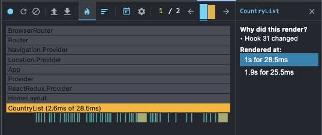
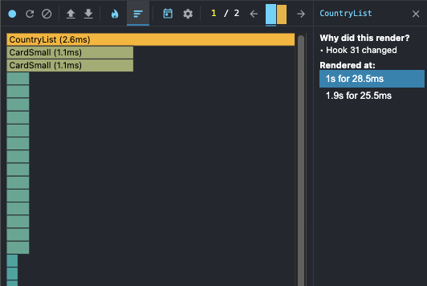

After optimization:
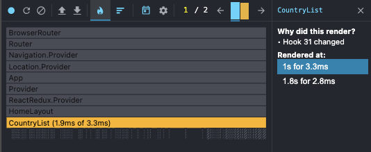
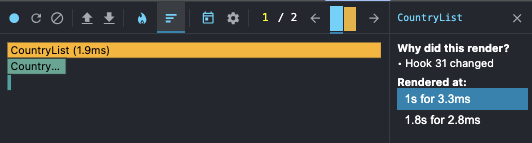
